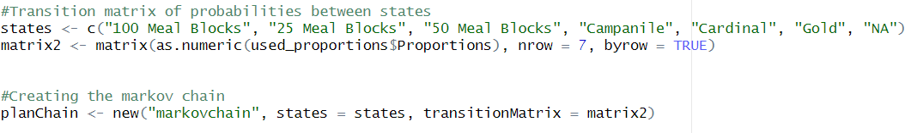

<style>
/* Move floating TOC to the right */
body .tocify {
  float: right !important;
  right: 15px !important;
  left: auto !important;
  border: 1px solid #ccc;
  border-radius: 6px;
  background-color: #fff;
  padding: 10px;
  box-shadow: 0 0 8px rgba(0,0,0,0.1);
}

/* Make sure content doesn't overlap the TOC */
.main-container {
  margin-right: 250px !important;
}

body {
  font-family: "Times New Roman", Times, serif;
  font-size: 14px;
  line-height: 1.65;
  color: #2c2c2c;
  background-color: #fafafa;
}

h1, h2, h3 {
  font-family: "Times New Roman", Times, serif;
  font-weight: bold;
  color: #003366;
}

code {
  background-color: #f4f4f4;
  padding: 2px 4px;
  border-radius: 4px;
  font-size: 95%;
}
</style>

## Introduction
Meal plans are an integral part of almost every college student on the Iowa State campus. Along with that, there are many varieties of meal plans to fit a specific student’s needs.  This project aims to answer the question of “What is the general popularity of the meal plans of Iowa State University?” as well as be able to predict the counts and pricing of each of the current meal plans at ISU in the near future. The answers to these questions are intended to help the administration of ISU Dining make more informed decisions about the build of and changes to the meal plans they currently offer. This would be through a one-stop interactive dashboard made to help simplify current data and provide simple visuals of predictive price and count models of each meal plan. This unique project simulates working with a client on a real-world problem. During this project, we were able to gain experience working with client-supplied data while formulating our questions and processing data based on the client’s requests or interests. Additionally, this project also introduces implementing an AI chatbot into our dashboard to act as an assistant to users by supplying a simplified summary of our visualizations to make the dashboard more friendly to a wider range of users.

## Data Pipeline

### Data Collection

#### Dining Data

Karen Rodekamp and Mary Schott from ISU Dining provided an Excel file containing one observation for each student who purchased a meal plan from Fall 2021 through Spring 2025. Each term was held in an individual Excel Sheet within the file. We combined each sheet into one .csv file and only kept fields we were interested in, dropping `Entry Status Description`. The following fields remained:

`ID`: randomized ID representing a student at Iowa State. This value represents the same student across all terms. Example: ID=10090081

`Meal.Plan.Description`: name of meal plan purchased by a student. Included values in the original data were Cardinal, Gold, Campanile, Bronze, Cyclone, Silver, CyFlex, Flex Blocks, Meal Blocks, and RA Plans. We dropped RA Plans and CyFlex due to low popularity and combined Flex Blocks and Meal Blocks for consistency as they are similar meal plan types. The remaining values are Cardinal, Gold, Campanile, Bronze, Cyclone, Silver, 25 Meal Blocks, 50 Meal Blocks, and 100 Meal Blocks.

`Term.Session.Description`: term which the meal plan was purchased in. Possible values: Fall 2021, Spring 2022, Fall 2022, Spring 2023, Fall 2023, Spring 2024, Fall 2024, Spring 2025.

`Room.Location.Description`: housing location of student purchasing meal plan. Possible values include on-campus residence halls, Barton, Birch, Buchanan, Eaton, Elm, Freeman, Friley, Geoffrey, Helser, Larch, Linden, Lyon, Maple, Martin, Oak, Roberts, Wallace, Welch, Willow, and Wilson; campus apartment housing, Fredericksen Court, Schilletter Village, and University Village; and Off-Campus.

We also received historical price data for each of the meal plans from ISU Dining. This file included each meal plan, the academic year (e.g., 2024-2025), the price for the entire year, and the price for each semester.

We joined the yearly price information with the meal plan data to get our final data set, which has 59,246 total observations.

`Price.Year`: the annual price of a meal plan, in dollars. Example: \$3928

```{r, echo=FALSE}
library(knitr)
data <- read.csv("../data_folder/clean/CurrentDiningData.csv")

kable(data[1:5, ], caption = "ISU Dining Data")

```

#### Regents Data

We downloaded public data owned by the Iowa Board of Regents from *data.iowa.gov* containing enrollment numbers by student classification. We kept only Iowa State University information and the years we were interested in.

```{r, echo=FALSE}
data <- read.csv("../data_folder/clean/CleanRegents.csv")
data1 <- data[,2:4]
kable(data1, caption = "Iowa Board of Regents Enrollment Data")

```

#### Housing Populations

We were interested in the relationship between on-campus locations and dining plans. Joshua Chappell with the Department of Residence provided us with the population of each residence hall for the terms we were interested in.

```{r, echo=FALSE}
data <- read.csv("../data_folder/clean/HousingPopulations.csv")
kable(data[1:5,], caption = "Department of Residence, Housing Populations")
```

### Assumptions

Due to the limited information we were given about the students in our data set, a few assumptions had to be made. All observations in the data set from ISU Dining are assumed to be undergraduate students so the Iowa Board of Regents data could be used for total undergraduate count. All students are also treated independently.

As stated earlier, RA plans and CyFlex were excluded due to their small sample size, and Flex Blocks were grouped with Meal Blocks for consistency.

## Models

### Poisson Regression Model

We were interested in predicting how many of each meal plan would be purchased in a given term. A Poisson Model was used to predict the number of meal plan purchases. Based on historical information, users can predict how many of a specific meal plan in a given semester will be purchased. 
The historic data is visualized below.

```{r, echo=FALSE, message=FALSE, warning=FALSE}
library(ggplot2)
library(dplyr)
# read in the data
dining <- read.csv("../data_folder/clean/CurrentDiningData.csv")
regents <- read.csv("../data_folder/clean/CleanRegents.csv")
# make `MealPlan` and `Term` factors, and `Term` numerical from 1-8 for their corresponding factor levels
# calculate price for each semester (price.year/2)
dining <- dining %>%
  mutate(MealPlan = factor(dining$Meal.Plan.Description),
         Term = as.numeric(factor(dining$Term.Session.Description, 
                                  levels = c("Fall 2021", "Spring 2022", "Fall 2022", "Spring 2023", 
                                             "Fall 2023", "Spring 2024", "Fall 2024", "Spring 2025"))),
         Price = Price.Year/2
  )

# make frequency table for MealPlan and Term

counts <- as.data.frame(table(dining$MealPlan, dining$Term)) %>%
  rename(MealPlan = Var1, Term = Var2, MealPlanCount = Freq) %>%
  mutate(Term = as.numeric(Term), 
         MealPlanCount = ifelse(MealPlanCount==0, NA, MealPlanCount))

undergradCounts <- regents %>%
  filter(Student.Classification=="Undergraduate") %>%
  dplyr::select(Year, count) %>%
  slice(rep(1:n(), each=2)) %>%
  mutate(Term = c(1:8),
         UndergradCount=count) %>%
  dplyr::select(-count)

data.final <- counts %>%
  left_join(dining %>% dplyr::select(MealPlan, Term, Price) %>% distinct(), by = c("MealPlan", "Term")) %>%
  dplyr::select(MealPlan, Term, Price, MealPlanCount) %>%
  left_join(undergradCounts, by="Term") %>%
  mutate(Semester = ifelse(Term %% 2 == 0, "Spring", "Fall")) %>%
  dplyr::select(MealPlan, Term, Semester, Year, MealPlanCount, UndergradCount)
g <- ggplot(data.final,
            aes(x = Year,
                y = MealPlanCount,
                color = MealPlan,
                shape = Semester,
                group = interaction(MealPlan, Semester))) + 
  geom_point(position = position_jitterdodge(
    jitter.width = 0.1, jitter.height = 0,
    dodge.width = 0.1)) +
  geom_line() + 
  scale_y_log10()

g
```

#### Model Description and Implementation
Poisson Regressions can be used when a response variable is a count with no clear maximum. The response variable, in this context, $Y_i$, the number of meal plans purchased, is assumed to follow a Poisson distribution: $Y_i \sim Poisson(\mu_i)$ where the expected count of $Y_i$ is $E(Y_i)=\mu_i$.Poisson Models also assume that the observations are independent of one another and the mean of the Poisson variable is equal to its variance.

Model selection was used to choose the most important explanatory variables when predicting meal plan count. The explanatory variables selected are the Meal Plan, Semester, Year, and the number of undergraduate students. The final model is as follows: 
$log(\hat{MealPlanCount})= \hat{\beta_0} + \hat{\beta_1}MealPlan + \hat{\beta_2}Semester+\hat{\beta_3}Year+\hat{\beta_4}UndergradCount$

The model is built in R using the `glm()` function. `data.clean` is the dining data with NA values omitted.

`finalModel <- glm(MealPlanCount ~ MealPlan + Semester + Year + UndergradCount, data=data.clean, family=poisson(link="log"))`

```{r, echo=FALSE}
data.clean <- na.omit(data.final)
finalModel <- glm(MealPlanCount ~ MealPlan + Semester + Year + UndergradCount,
                  data=data.clean, family=poisson(link="log"))

summary(finalModel)
```

In the Shiny dashboard, users can input a meal plan, semester, year, and the number of undergraduate students to predict the number of meal plans purchased.

### Markov Model
To gain a better understanding and better simulate the churn of meal plans amongst students, we developed a Markov model based on the proportions at which students transition from one meal plan to another from Spring 2024 to Fall 2024. A Markov model is a statistical model that describes a sequence of possible events, where the probability of each event depends only on the state attained in the previous term. Meaning the model will determine what the next state will be based only which state the model is currently in. The purpose of this model in this project is to help provide a predictive analysis of which meal plans may be most popular in the long term, as well as a simulation of how a student may progress through meal plans across four years, to help ISU Dining in deciding which meal plans may need to be modified and which as good as they currently are.

#### Model Description & Implementation
We first calculated the proportion of students who transitioned to one of the six current meal plans in the Fall 2024 term, starting from the Spring 2024 term, for each meal plan. We still included “NA” values as a current student may choose not to have a meal plan in a semester. We get the proportions by filtering the full data for only the Spring 2024 and Fall 2024 terms, getting the counts of occurrences of each combination of meal plans, and then finally dividing each by the total number of occurrences where the meal plan was in the Spring 2024 starting term. We still The model is then fitted using the new function in base R, being given “markovchain” as the object of interest, the 7 meal plans as the states at which we can be in, and our calculated proportion in the form of a matrix known as the “Transition Matrix” using the matrix() function in base R.


Once trained, the model can predict the long-term probability of which of our seven states (six meal plans or NA) a student may be in. These probabilities are obtained through the use of the “steadyStates” function as shown below:


#### Model Visualization
Using the trained Markov model and the “ggplot2” package in R, we are able to create a visualization for the simulation of a student from a given starting meal plan. The figure below shows an example plot made using ggplot2 of a simulation where the term we are in is on the x-axis and the predicted meal plan of that student is on the y-axis with a line to tract the progression.


### Price Prediction Model (Linear Regression)

To forecast future meal plan pricing, a linear regression model was developed to predict the expected price of a selected meal plan type for an upcoming term (e.g., Fall 2025). Based on historical pricing data, the model optionally incorporates an inflation factor, allowing ISU Dining to simulate and plan offerings in response to anticipated pricing trends and economic conditions.

#### Model Description

We implemented a **simple linear regression model** of the form:

$$
\text{Price}_{i} = \beta_0 + \beta_1 \cdot \text{Term}_i + \epsilon_i
$$

For each meal plan type, we fit a separate linear model using past prices and term (numeric encoding of semester/year). The model assumes a linear relationship between the term and the price of the meal plan. Users may also optionally apply an **inflation adjustment**, allowing them to forecast prices based on projected inflation beyond historical trends.

-   **Response Variable:** `Price` (numeric, in dollars)
-   **Explanatory Variable:** `Term` (e.g., Spring 2021 = 1, ..., Fall 2024 = 8)
-   **Model Type:** Simple linear regression
-   **Optional User Input:** Inflation factor (numeric multiplier on predicted price)

This model assumes:

-   Linearity between term and price

-   Normally distributed residuals

-   Homoscedasticity (constant variance)

-   Independence of observations

#### Model Implementation

This model was implemented using `lm()` function from base R.

**Packages Used:**

-   `shiny` – For UI integration

-   `dplyr`, `tidyr` – Data manipulation

-   `ggplot2` – For exploratory price visualizations

**Simplified Code Example:**

```{r, eval=FALSE}
# Filter the dataset for a specific meal plan
meal_data <- filter(meal_prices_df, MealPlan == input$selected_mealplan)

# Fit the linear model
price_model <- lm(Price ~ Term, data = meal_data)

# Predict price for a given term
predicted_price <- predict(price_model, newdata = data.frame(Term = input$future_term))

# Apply optional inflation adjustment
if (!is.null(input$inflation)) {
  predicted_price <- predicted_price * input$inflation
}
```


## Dashboard

The dashboard for the Statistical Superstars project was built using **R Shiny**, a web application framework for R. Shiny was selected due to its flexibility, ability to integrate R code directly into web interfaces, and its support for building dynamic, interactive dashboards, aligning perfectly with our project goals.

### Dashboard Construction and Layout
```{r, results='asis', echo=FALSE}
cat('
<div style="float: right; width: 140px; margin-left: 15px;">
  
</div>
')
```

The dashboard consists of several structured **tabs** to organize content meaningfully:

-   **Overview:** Introduction to the project, purpose, assumptions, and key definitions.
-   **Explanatory Analysis:**
    -   **Meal Plans:** Visualizations of meal plan distributions, trends over time, and price analyses.
    -   **Housing:** Exploration of student housing distributions and their relation to meal plan selections.
-   **Predictive Models:**
    -   **Churn Analysis:** Markov Chain simulations for meal plan transitions.
    -   **Meal Plan Prediction:** Predictive models for the number of meal plans purchased (Poisson) and price forecasting (Linear Regression).
-   **Conclusion:** Summary of findings, key insights, and recommendations based on analysis and model results.

This layout directly supports the project goals by separating **exploratory** and **predictive** components and providing the audience with a clear, logical path from understanding the data to making future decisions.

### Logic Behind Layout

The dashboard is designed to progressively guide users from: 1. Understanding the background and purpose (Overview), 2. Exploring the historical data (Explanatory Analysis), 3. Predicting future trends (Predictive Models), 4. Summarizing takeaways (Conclusion).

By moving from simple explanations to complex modeling, the dashboard ensures accessibility for both statistical and non-statistical users, supporting ISU Dining's decision-making process.

### User Inputs and Controls

The dashboard offers multiple types of **user inputs** to make exploration customizable:

-   **Select Inputs (Categorical):** Users can select specific semesters, meal plans, and housing locations to filter the data displayed.
-   **Numeric Inputs:** For model components, users can input inflation factors for price prediction or set seeds for Markov simulations.
-   **Multiple Selections:** Users can select multiple meal plans or housing locations to compare.
-   **Sliders and Ranges:** Some filters allow users to select a range of semesters or years for more dynamic analysis.
-   **Optional Text Inputs:** Setting random seeds for simulations.

These inputs allow users to personalize the analysis based on their needs and support project goals by enabling flexible scenario analysis for ISU Dining.

### Outputs

The dashboard dynamically displays the following **outputs**:

-   **Interactive Plots (Plotly):** Distribution graphs, time-series plots, model prediction plots, and Markov simulation graphs.
-   **Tables:** Snapshots of the underlying data, summaries of model outputs (e.g., coefficients, prediction tables).
-   **Text Outputs:** Summaries and interpretations for visualizations, conclusions from model results.
-   **Chatbot Summaries:** An AI chatbot provides simplified descriptions of graphs for better accessibility.

As users adjust inputs, **plots, tables, and texts** immediately update to reflect new selections, making the dashboard highly responsive and user-centered.

### Technology and Hosting

-   **Technology Stack:** RStudio, Shiny, Plotly, dplyr, tidyr, ggplot2, shinydashboard, Bootstrap themes.
-   **Hosting:** Deployed on [ShinyApps.io](https://www.shinyapps.io/), providing public access without the need for local hosting.

## Assessment of Technology

Overall, **R Shiny** provided a smooth development experience for building the dashboard. Shiny’s **ease of use** was critical — it allowed us to integrate plots, models, and text with relatively minimal code overhead. The **features** like reactive inputs and Plotly for interactive graphs made the user experience dynamic and intuitive. **Speed** was generally sufficient for the dashboard’s size, although model simulations like Markov chains can take slightly longer depending on the number of simulations.

Overall, Shiny was an excellent choice for this project, balancing power, interactivity, and usability for both the developers and the intended ISU Dining audience.

## Learning

### Dashboard Insights
The dashboard provides several insights into the meal plan purchasing behavior of Iowa State University students. The most popular meal plans over the years provided are Cardinal and Gold, with Campanile actually surpassing Gold in the more recent terms. The data also shows that the number of meal plans has been gradually increasing over time and is predicted to continue this trend. Additionally, the dashboard provides a simulation of how students may transition between meal plans over time, which can help ISU Dining understand how to better market their meal plans to students. From our analysis, we can see that Campanile has the best retention rate of the more popular meal plans while the Block meal plans outperform **all** other meals plans.

### Team Takeaways
The team learned a lot about the process of building a dashboard and the importance of data visualization. We learned how to work with a "client" and ensure their data aligns with what we had planned for the dashboard. We also learned how to work with different data sources, how to clean and manipulate data for analysis, how to integrate a custom LLM api, how to integrate predictive models to meet real world needs, and how to put everything together using an application like R-shiny. The experience of working with a real world dataset gave the team a sense of what data science outside of course work looks like.


## Next Steps

Currently, our team is confident in our dashboard with regard to its abilities and overall setup, however, we could make additional meaningful implementations given more time. 

### Data 
Our current data sources are sufficient for the needs of our dashboard. However, there were steps of our data collection that, if provided, would have enabled us to look into deeper trends. For the sake of student privacy, the IDs for each student were randomized in the data set provided by Iowa State University Dining. However, if this was not the case, we could look into more relationships like the correlation between an individual's year in school and meal plans, the correlation between majors and meal plan purchases, or being able to predict the meal plan based on the extended features of each individual. With more time, maybe these ideas, along with the insights of our current dashboard, could be proposed to ISU dining to have access to more insightful data.


Building on the search for more data, our team was working with the housing department during the preliminary weeks of the project with the intention of trying to get more information on reviews of the dining halls. The useful information from this data would have been individual survey results like:


-    Future living plans (whether students are planning to return to living on campus)
-    Reasons why students are moving off campus
-    Satisfaction with ISU Dining and parts of the meal plan

These results would have provided more evidence supporting our findings. Put simply, it would enable ISU dining to not only see the trends but also recognize the issues that could be causing these trends. This data was unable to be collected because of the randomization of student IDs; with more time and working closely with ISU Dining, we believe that that could eventually be solved.

### UI

As said previously in the report, our team has incorporated a chatbot into our dashboard. Currently, the context of the bot goes as far as summarizing the current file layout, model layout, and the findings of each section of the dashboard. This is a good start; however, our team proposed giving the bot the ability to "see" the dynamically changing graphs to aid the user's understanding of the specific relationships that they input into the model. This is within the realm of the bot API; our team was simply not able to add this feature with the constraint of time.

## Availability
All documentation for this project can be found in the GitHub repository https://github.com/aawyatt/DS4010_E/tree/main. Within the repository, the code for the dashboard is within Code → Shiny. 
The public dashboard is contained in this link: https://ds4010groupe.shinyapps.io/shiny/. We plan to keep the link public, but we will not receive additional data for ISU Dining, so the dashboard will not include any future data.

## Acknowledgement 
Our group would like to acknowledge the following people for supplying us with ISU's dining and housing data that was used to create each of the models and visuals during this project. Without them this project would not have been possible:

- Rodekamp, Karen S [Director of ISU Dining]
- Schott, Mary A [Associate Director of IT & Menu Management for ISU Dining]
- Chappell, Joshua M [Associate Director of Administrative Services for ISU Dept of Residence]
